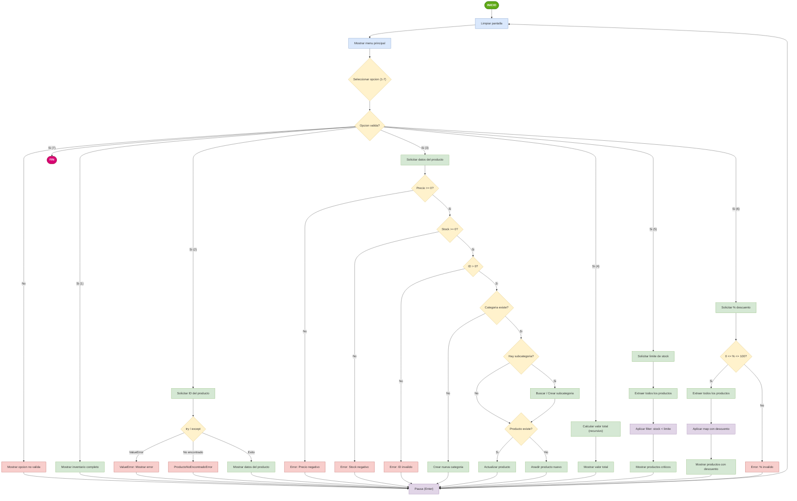

```mermaid
flowchart TD
    %% Estilos
    classDef inicio fill:#60a917,stroke:#2d7600,color:#fff,font-weight:bold
    classDef fin fill:#d80073,stroke:#A50040,color:#fff,font-weight:bold
    classDef proceso fill:#dae8fc,stroke:#6c8ebf
    classDef decision fill:#fff2cc,stroke:#d6b656
    classDef funcion fill:#d5e8d4,stroke:#82b366
    classDef error fill:#f8cecc,stroke:#b85450
    classDef datos fill:#e1d5e7,stroke:#9673a6

    INICIO(["INICIO"]):::inicio
    LIMPIAR["Limpiar pantalla"]:::proceso
    MENU["Mostrar menu principal"]:::proceso
    SELECCION{"Seleccionar opcion (1-7)"}:::decision
    VALIDA{"Opcion valida?"}:::decision
    NOVALIDA["Mostrar opcion no valida"]:::error
    PAUSA["Pausa (Enter)"]:::datos
    OP1["Mostrar inventario completo"]:::funcion
    OP2_SOL["Solicitar ID del producto"]:::funcion
    OP2_TRY{"try / except"}:::decision
    OP2_VALERR["ValueError: Mostrar error"]:::error
    OP2_NOTFOUND["ProductoNoEncontradoError"]:::error
    OP2_EXITO["Mostrar datos del producto"]:::funcion
    OP3_SOL["Solicitar datos del producto"]:::funcion
    OP3_PRECIO{"Precio >= 0?"}:::decision
    OP3_ERR_PRECIO["Error: Precio negativo"]:::error
    OP3_STOCK{"Stock >= 0?"}:::decision
    OP3_ERR_STOCK["Error: Stock negativo"]:::error
    OP3_ID{"ID > 0?"}:::decision
    OP3_ERR_ID["Error: ID invalido"]:::error
    OP3_CAT{"Categoria existe?"}:::decision
    OP3_CREAR_CAT["Crear nueva categoria"]:::funcion
    OP3_SUBCAT{"Hay subcategoria?"}:::decision
    OP3_BUSCAR_SUB["Buscar / Crear subcategoria"]:::funcion
    OP3_PROD{"Producto existe?"}:::decision
    OP3_ACT["Actualizar producto"]:::funcion
    OP3_NUEVO["Anadir producto nuevo"]:::funcion
    OP4_CALC["Calcular valor total (recursivo)"]:::funcion
    OP4_MOSTRAR["Mostrar valor total"]:::funcion
    OP5_LIM["Solicitar limite de stock"]:::funcion
    OP5_EXT["Extraer todos los productos"]:::funcion
    OP5_FILTER["Aplicar filter: stock < limite"]:::datos
    OP5_MOSTRAR["Mostrar productos criticos"]:::funcion
    OP6_PCT["Solicitar % descuento"]:::funcion
    OP6_VAL{"0 <= % <= 100?"}:::decision
    OP6_ERR["Error: % invalido"]:::error
    OP6_EXT["Extraer todos los productos"]:::funcion
    OP6_MAP["Aplicar map con descuento"]:::datos
    OP6_MOSTRAR["Mostrar productos con descuento"]:::funcion
    FIN([FIN]):::fin

    INICIO --> LIMPIAR
    LIMPIAR --> MENU
    MENU --> SELECCION
    SELECCION --> VALIDA
    VALIDA -- No --> NOVALIDA
    NOVALIDA --> PAUSA
    PAUSA --> LIMPIAR
    VALIDA -- Si (1) --> OP1
    OP1 --> PAUSA
    VALIDA -- Si (2) --> OP2_SOL
    OP2_SOL --> OP2_TRY
    OP2_TRY -- ValueError --> OP2_VALERR
    OP2_TRY -- No encontrado --> OP2_NOTFOUND
    OP2_TRY -- Exito --> OP2_EXITO
    OP2_VALERR --> PAUSA
    OP2_NOTFOUND --> PAUSA
    OP2_EXITO --> PAUSA
    VALIDA -- Si (3) --> OP3_SOL
    OP3_SOL --> OP3_PRECIO
    OP3_PRECIO -- No --> OP3_ERR_PRECIO
    OP3_PRECIO -- Si --> OP3_STOCK
    OP3_STOCK -- No --> OP3_ERR_STOCK
    OP3_STOCK -- Si --> OP3_ID
    OP3_ID -- No --> OP3_ERR_ID
    OP3_ID -- Si --> OP3_CAT
    OP3_CAT -- No --> OP3_CREAR_CAT
    OP3_CAT -- Si --> OP3_SUBCAT
    OP3_SUBCAT -- No --> OP3_PROD
    OP3_SUBCAT -- Si --> OP3_BUSCAR_SUB
    OP3_BUSCAR_SUB --> OP3_PROD
    OP3_PROD -- Si --> OP3_ACT
    OP3_PROD -- No --> OP3_NUEVO
    OP3_ERR_PRECIO --> PAUSA
    OP3_ERR_STOCK --> PAUSA
    OP3_ERR_ID --> PAUSA
    OP3_CREAR_CAT --> PAUSA
    OP3_ACT --> PAUSA
    OP3_NUEVO --> PAUSA
    VALIDA -- Si (4) --> OP4_CALC
    OP4_CALC --> OP4_MOSTRAR
    OP4_MOSTRAR --> PAUSA
    VALIDA -- Si (5) --> OP5_LIM
    OP5_LIM --> OP5_EXT
    OP5_EXT --> OP5_FILTER
    OP5_FILTER --> OP5_MOSTRAR
    OP5_MOSTRAR --> PAUSA
    VALIDA -- Si (6) --> OP6_PCT
    OP6_PCT --> OP6_VAL
    OP6_VAL -- No --> OP6_ERR
    OP6_VAL -- Si --> OP6_EXT
    OP6_EXT --> OP6_MAP
    OP6_MAP --> OP6_MOSTRAR
    OP6_MOSTRAR --> PAUSA
    OP6_ERR --> PAUSA
    VALIDA -- Si (7) --> FIN
```
